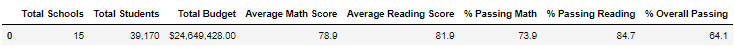

# School_District_Analysis
## Overview of the school district analysis: 
The school board notified Maria and her supervisors that Thomas High School ninth graders math and reading grades appear to have been altered. Although the school board does not know the full extent of academic dishonesty, they want to uphold state-testing standards and have turned to Maria for help. We've replaced the math and reading scores for Thomas High School with NaNs while keeping the rest of the data intact. We then repeat the school district analysis with the replaced data.

## Results:

- We replaced the data from Thomas High School 9th Graders with NaNs, which affects the data as we are missing the set of data for one of the grades in the schools. 

- Overall passing score was 64.1% with the 15 schools.

 

- Running this analysis does show that Thomas High School would fall within the top 5 high performing school, however this does not account for 9th grade. 

- Based on the school spending the data shows that the less spending range for a student shows a higher average score. 

- Smaller school sizes also help increase the average scores.

- District schools show a worst outcome than Charter schools, overall passing percent has a difference of 36%.

